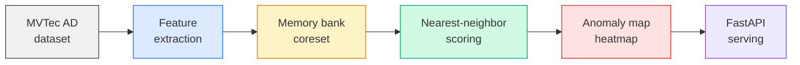

# Anomaly Detection API

[](https://github.com/YanissAmz/anomaly-detection-api/actions)


Visual anomaly detection service using **PatchCore** on MVTec AD, served as a production-ready **FastAPI** endpoint with heatmap overlay visualization and a web demo.

> PatchCore (Roth et al., CVPR 2022) achieves state-of-the-art anomaly detection by building a memory bank of normal patch features and detecting anomalies via nearest-neighbor distance.

---

## Pipeline



| Stage | What | Key metric |
|---|---|---|
| **Feature extraction** | WideResNet50 layer2+3 patch features | -- |
| **Memory bank** | Coreset subsampling of normal features | Bank size |
| **Scoring** | K-NN distance to memory bank | AUROC |
| **Visualization** | Per-pixel anomaly heatmap overlay | -- |
| **Serving** | FastAPI with image upload endpoint | Latency (ms) |

---

## Quick start

```bash
git clone https://github.com/YanissAmz/anomaly-detection-api.git
cd anomaly-detection-api

# Install
uv venv && source .venv/bin/activate
uv pip install -e ".[dev]"

# Run tests
make test

# Start API server
make serve
```

---

## Project structure

```
src/
  models/             PatchCore implementation
  api/                FastAPI application
  preprocessing/      Image transforms & utilities
  demo/               Web interface
configs/              YAML configs per MVTec category
scripts/              CLI entrypoints (train, evaluate, serve)
tests/                Unit & integration tests
results/              AUROC tables, heatmap samples
docs/                 Technical writeup
```

---

## API

```bash
# Health check
curl http://localhost:8000/health

# Predict anomaly
curl -X POST http://localhost:8000/predict \
  -F "file=@test_image.png"
```

**Endpoints:**
| Method | Path | Description |
|---|---|---|
| `GET` | `/health` | API & model status |
| `POST` | `/predict` | Upload image, get anomaly score + heatmap |

---

## Results

> Benchmarks on MVTec AD. Full results in `results/`.

| Category | AUROC (image) | AUROC (pixel) | Latency (ms) |
|---|---|---|---|
| Bottle | -- | -- | -- |
| Cable | -- | -- | -- |
| Capsule | -- | -- | -- |

*Results will be filled after running evaluation on all categories.*

---

## Tech stack

| | |
|---|---|
| **Model** | PatchCore (WideResNet50 backbone) |
| **Dataset** | MVTec AD (15 categories) |
| **Scoring** | K-NN distance to coreset memory bank |
| **Serving** | FastAPI + Uvicorn |
| **CI** | GitHub Actions (ruff + pytest) |

---

## Limitations & future work

- Coreset subsampling is random; greedy coreset (original paper) not yet implemented
- Single-category models; no unified multi-category model
- No comparison with other methods (STFPM, FastFlow, EfficientAD)
- Planned: heatmap overlay endpoint, Gradio demo, multi-method benchmarks

---

## License

MIT
