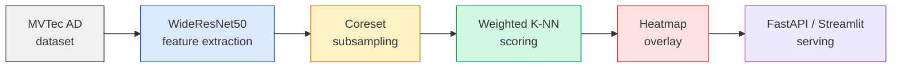

# Anomaly Detection API

[](https://github.com/YanissAmz/anomaly-detection-api/actions)


Visual anomaly detection service using **PatchCore** on MVTec AD, with **FastAPI** serving, heatmap overlay visualization, and interactive **Streamlit** dashboard.

> PatchCore (Roth et al., CVPR 2022) builds a memory bank of normal patch features using a pre-trained WideResNet50 backbone, then detects anomalies via weighted K-NN distance with coreset subsampling.

---

## Pipeline



| Stage | What | Key metric |
|---|---|---|
| **Feature extraction** | WideResNet50 layer2+3 patch features with AvgPool | 1536-dim patch vectors |
| **Memory bank** | Greedy farthest-point coreset subsampling | Bank size (configurable) |
| **Scoring** | Weighted K-NN (k=3) distance to memory bank | Image + pixel AUROC |
| **Visualization** | Per-pixel heatmap with Gaussian blur overlay | -- |
| **Serving** | FastAPI + Streamlit dashboard | Latency (ms) |

---

## Quick start

```bash
git clone https://github.com/YanissAmz/anomaly-detection-api.git
cd anomaly-detection-api

# Install
uv venv && source .venv/bin/activate
uv pip install -e ".[dev,demo]"

# Run tests (37 tests, no GPU needed)
make test

# Train on a MVTec category
make train                            # default: bottle
python scripts/train.py --category hazelnut

# Evaluate
python scripts/evaluate.py --category bottle

# Start API server
make serve

# Launch Streamlit dashboard
make demo
```

---

## Project structure

```
src/
  config.py           YAML config loader with env var overrides
  models/
    patchcore.py      PatchCore model (fit, predict, evaluate, save/load)
    coreset.py        Greedy farthest-point coreset subsampling
  api/
    app.py            FastAPI application (/build, /predict, /predict/heatmap)
    schemas.py        Pydantic request/response models
  data/
    mvtec.py          MVTec AD dataset with auto-download
  preprocessing/
    transforms.py     Image & mask transforms (ImageNet + CLIP)
  demo/
    app.py            Streamlit interactive dashboard
    viz.py            Heatmap overlay visualization
configs/              YAML experiment configs
scripts/              CLI entrypoints (train, evaluate)
tests/                37 unit tests
```

---

## API

```bash
# 1. Build model (trains PatchCore on a category)
curl -X POST http://localhost:8000/build \
  -H "Content-Type: application/json" \
  -d '{"category": "bottle", "coreset_ratio": 0.1}'

# 2. Predict anomaly
curl -X POST http://localhost:8000/predict \
  -F "file=@test_image.png"

# 3. Get heatmap overlay (base64 PNG)
curl -X POST http://localhost:8000/predict/heatmap \
  -F "file=@test_image.png"
```

**Endpoints:**
| Method | Path | Description |
|---|---|---|
| `GET` | `/health` | API & model status |
| `POST` | `/build` | Train PatchCore on a MVTec category |
| `POST` | `/predict` | Upload image, get anomaly score |
| `POST` | `/predict/heatmap` | Upload image, get score + heatmap overlay |

---

## Results

> Benchmarks on MVTec AD — WideResNet50 backbone, coreset_ratio=0.1, k=3, RTX 3090 24 GB. Numbers from a fresh end-to-end run: `python scripts/train.py --category all && python scripts/evaluate.py --category all --out results/auroc_full.json`. Raw JSON in [`results/auroc_full.json`](results/auroc_full.json).

| Category | Image AUROC | Pixel AUROC | Eval (s) |
|---|---:|---:|---:|
| Bottle      | **1.000** | 0.983 | 4.8 |
| Cable       | 0.990     | 0.982 | 8.6 |
| Capsule     | 0.972     | 0.986 | 7.5 |
| Carpet      | 0.990     | 0.987 | 6.9 |
| Grid        | 0.980     | 0.975 | 3.6 |
| Hazelnut    | **1.000** | 0.985 | 7.1 |
| Leather     | **1.000** | 0.990 | 6.9 |
| Metal nut   | 0.997     | 0.983 | 4.9 |
| Pill        | 0.953     | 0.977 | 8.4 |
| Screw       | 0.978     | 0.989 | 7.8 |
| Tile        | 0.990     | 0.951 | 5.8 |
| Toothbrush  | **1.000** | 0.986 | 2.2 |
| Transistor  | **1.000** | 0.970 | 5.6 |
| Wood        | 0.989     | 0.935 | 4.7 |
| Zipper      | 0.989     | 0.980 | 6.8 |
| **Average** | **0.989** | **0.977** | 6.1 |

Within reach of the original PatchCore paper (99.1% / 98.1% image/pixel
AUROC). Five categories saturate at 1.000 image AUROC; the remaining ten
land 0.95–0.99. Pixel AUROC is more uniform (0.93–0.99). Wood is the
weakest at the pixel level (0.935) — its grain pattern triggers
false-positive heatmap response on parts of the image that are textural
but not anomalous.

Total wall-clock for the run: ~10 min training + ~1.5 min evaluation
(15 × ~30s training, 15 × ~6s eval, RTX 3090).

---

## Tech stack

| | |
|---|---|
| **Model** | PatchCore with WideResNet50 backbone |
| **Coreset** | SparseRandomProjection + greedy farthest-point |
| **Scoring** | Weighted K-NN (k=3) with softmax normalization |
| **Dataset** | MVTec AD (15 categories, auto-download) |
| **API** | FastAPI + Uvicorn |
| **Dashboard** | Streamlit + Plotly |
| **CI** | GitHub Actions (ruff + pytest) |
| **Config** | YAML + environment variable overrides |

---

## Limitations & future work

- Single-category models; no unified multi-category model
- CLIP backbone support architected but not yet wired
- No comparison with other methods (STFPM, FastFlow, EfficientAD)
- Planned: multi-method benchmarks, batch inference endpoint, custom dataset support

---

## License

MIT
